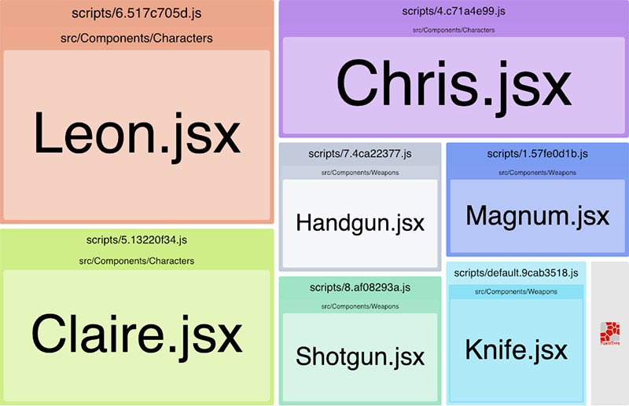

## Webpack + React Dynamic Import Boilerplate

#### Features
Pre-configured webpack with
* **Demo of using dynamic import and code splitting**
* Basic essentials (eslint, jest, sass, cssModule)
* Vendor code splitting (Optional)

This Demo is using [React-loadable](https://github.com/jamiebuilds/react-loadable) to import component dynamically.<br/>
However, code splitting is also working with React.lazy and any other component or library using dynamic import.

#### Demo
[Click here to open demo page](https://ohsiwon.github.io/Webpack-React-Dynamic-Import-Boilerplate/example)
* App shows 3 different characters and all of them are dynamically imported.
* Each of character loads a different combinations of weapon.
* Weapons are also dynamically imported **except knife**. 
* Use the Network activity tab from browser devtool to monitor data flow.


#### Bundle Analyzer screenshot


* These splitted chunk files are generated through dynamic import **except knife**
* Knife is directly imported from 3 characters but splitted out from main chunk file because [minChunks](https://webpack.js.org/plugins/split-chunks-plugin/#splitchunks-minchunks) value is 2.
* Knife is saved to `default.js` chunk which it can be shared with any scripts that imported directly from one component.

---

#### How to use

|Start                    |Command                 |
|-------------------------|------------------------|
|Install                  | `npm install`          |
|Development Environment  | `npm run dev`          |
|Run test                 | `npm run test`         |
|Build coverage           | `npm run test:coverage`|
|Build production         | `npm run build`        |
|Run production from local| `npm start`            |

#### Bundle Analyzer
Build production with Bundle Analyzer `BA_MODE={server|static} npm run build`

#### Using cssModule
To enable cssModule append query `module` to the end of target path.
```js
import from './style.css'; // default
import style from './style.css?module'; //cssModule

import from './style.scss'; // default
import style from './style.scss?module'; //cssModule
```
cssModule can be used together with regular CSS.

